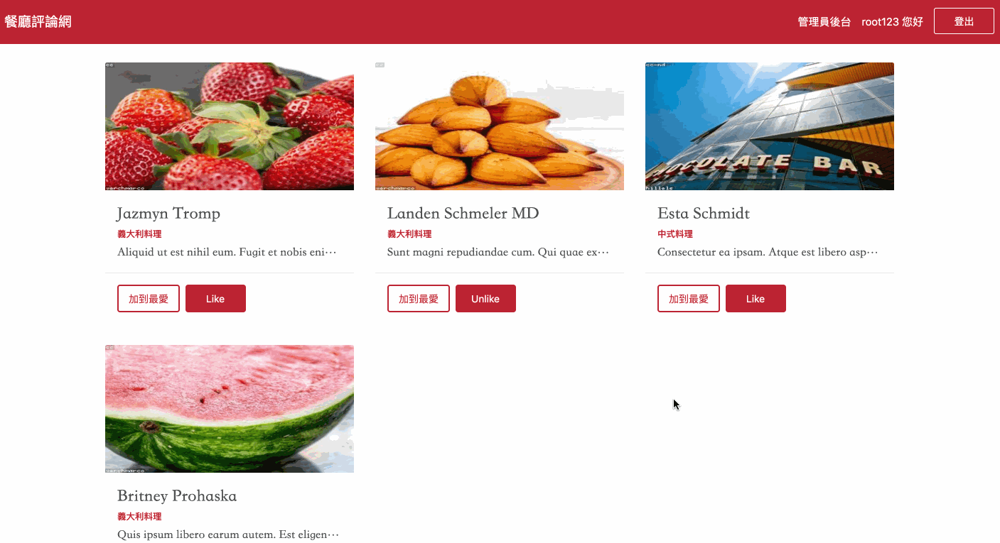

# forum-front-end-vue
## ※專案介紹(Project Introduction)
構建美食餐廳論壇頁面。



## ※功能介紹(Function Introduction)
### 使用者功能
- 註冊用戶
- 根據餐廳類別篩選
- 觀看最新餐廳、人氣餐廳、美食達人
- 觀看自己與其他使用者的個人資料
- 追縱其他使用者
- 撰寫評論
- 加入與移除最愛跟Like

### 後台功能
- 新增餐廳、類別、使用者
- 修改餐廳、類別、使用者
- 刪除餐廳、類別、使用者

## ※安裝專案(Install Project)

## Project setup
```
npm install
```

### Compiles and hot-reloads for development
```
npm run serve
```

### Compiles and minifies for production
```
npm run build
```

### Lints and fixes files
```
npm run lint
```

### Customize configuration
See [Configuration Reference](https://cli.vuejs.org/config/).
